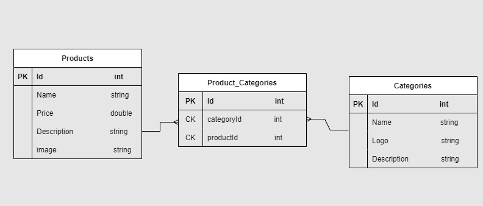
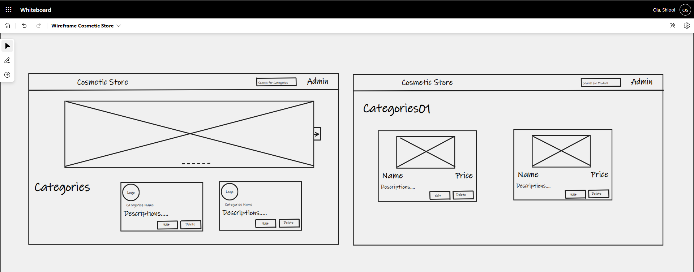

# E-Commerce-App

## Description

## ERD 

### Explanation of Tables:
- Category Table: contains the differnt categories for the Cosmetic and holds the name of each category.
- Product Table: contains the prices, and the names of each cosmetic for sale.
- CategoryProduct Table: contains the keys to items in the Category and Product tables as a composite key. 
- CategoryProduct table is a joint table.

### Explanation of Relationships:
- Category Table:
    
    - Many:Many relationship CategoryProduct table in order to get all the products in a category

- CategoryProduct Table(joint entity table):
    - One:Many Category table so it can match the products for each category
    - One:Many Product table so that all products can be found for each category

- Product Table
    - Many:Many Category table in order to get price, and cosmetic names found for each category

## Wireframe 
