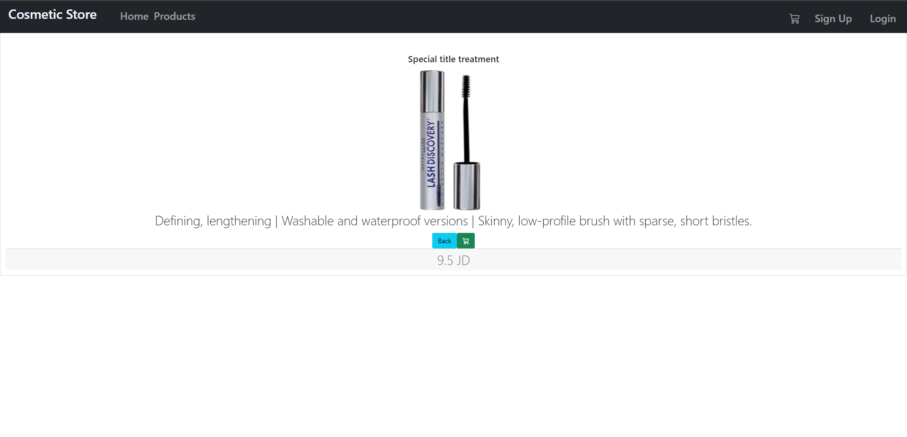
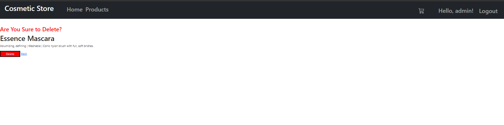

# E-Commerce-App

### Name of Contributors:

- Ola M Al-shlool 
- Islam Alsawaftah
## Description
This is an E-Commerce store COSMETIC STORE built with ASP.NET Core's MVC and Razor Pages. The web app features a user 
login security system, a category page, a product page, and a product details page that allows the user to add items to the 
cart for checkout. This web app is built to provide a satisfying shopping experience to our users.

### Link to deployed website
[COSMETIC STORE WEBSITE](https://cosmetic-storeapp.azurewebsites.net/Category/Index)

[E-Commerce-App - Vulnerability Report ](Vulnerability.md)

### What is the product you are selling? 

We're selling cosmetic products, everything related to makeup and beauty staff. 

### Project Overview 

Our project is consist of a cosmetic store web application have the following capabilities

1- customer can easily register if he didn't have an account, otherwise login with a verified username and password

2 - verified customer can explore categories and products details related to each category 

3- customers can add, update, or delete any product to their cart and choose the quantity they need

4- customers can easily check their cart content while shopping

5- customers will receive an email when they register to the web application, and also cart content details once they click the checkout button after completing shopping.

## ERD 

### Explanation of Tables:
- Category Table: contains the differnt categories for the Cosmetic and holds the name of each category.
- Product Table: contains the prices, and the names of each cosmetic for sale.
- Cart Table: contains userid and cartId. 
- CartProduct table is a joint table.
- Order Tabel : contains the UserID, and the info about user.
- OrderItems Table: is a joint table, contains OrderID, ProductID and Quantity

### Explanation of Relationships:
- Category Table:
    
    - Many to Many relationship CategoryProduct table in order to get all the products in a category

- Product Table
    - Many to Many Category table in order to get price, and cosmetic names found for each category
    
- Cart Table
  -  One to Many relationship with CartProduct table
-  Order Table
   -  One to Many relationship with OrderItem table

## Visuals
### Category 
Category - Logged Out

Category - Logged In

### Account
Register 

Login

### Shop
Product index 

Detail Product - Logged Out

Detail Product - Logged In

MiniCart

Cart Empty

Cart 

### Admin
Dashboard

Category

Category -Detail

Category - Create

Category - Edit

Category - Delete

Product

Product -Detail

Product - Create

Product - Edit

Product - Delete

Order

Order Details

### Access Denied Page

### User Stories

- ## Administrator
  - As an admin user, I would like to have a dashboard where I can see a list of product categories
  - As an admin user, I would like to view a detail page for each category so that I can eventually edit its data or delete it
  - As an admin user, I would like to see a list of the products assigned to a category on the category details page
  - As an admin user, I would like a detail page for each product so that I can eventually edit its data or delete it
  - As an administrator I would like add and save a new category so that I can expand my product lines
  - As an administrator I would like add and save a new product so that I can expand my inventory
  - As an administrator I would like to associate a product to a category so that my users can more easily browse our inventory
  - As an administrator I would like to be able to delete products and categories as needed
  - As an administrator I would like to be able to edit/modify categories so that I can change my storefront structure in real time
  - As an administrator I would like to be able to edit/modify products so that I can change my inventory in real time
  - As the site owner, I would like to secure the admin dashboard so that only users with an administrative role can access it
  - As an administrator I would like to ensure that only users in the Administrator role can add categories or products
  - As an administrator I would like to ensure that only users in the Editor permissions can modify categories or products
  - As an administrator I would like to ensure that only users in the Editor permissions can add a product to a category
  - As an administrator I would like to ensure that only users in the Administrator permissions can delete categories or products
  - As an administrator I would like upload a picture for each product so that my shoppers will know what our products look like
  - As an administrator I would like replace a picture for each product so that I can keep my inventory up to date
  - As an administrator, I would like a preview of my product listings so that I can see what my customers will see in the online store
  - As an administrator, I would like a copy of all purchases emailed to our sales department so that they can update our accounting system
  - As an administrator, I would like a copy of all purchases emailed to our warehouse so that they can begin the fulfillment process

- ## User

  - As a user, I would like to see products available for sale so that I can browse through the inventory for purchase.
  - As a user, I would like to register for an account on the site, so that I can make purchases
  - As a user, I would like to securely login to my account so that I can add products to my shopping cart
  - As a user, I would like a way to store the items I wish to purchase in a cart within the application.
  - As a user, I would like the ability to view my desired purchases while browsing the other products on the site.
  - As a user I would like a dedicated page where I can view all the products I wish to purpose all in one location.
  - As a user, I would like to see a summary of my purchase after completing my checkout process.
  - As a user, I would like a summary of my purchase to be emailed to me so that I can store the receipt for my records.
  - As a user, I would like to be thanked for my purchase following completion of order processing

## Wireframe 

